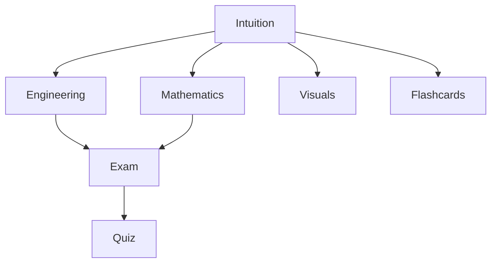

# 02 — Content Structure: The 7-Layer System

**Purpose:** Detailed breakdown of each content layer and how they work together

---

## Overview

Every concept in Caltronic V2 consists of **7 layers**, each serving a specific learning objective. This multi-layer approach enables IQ-scaled learning: students can engage at their current level and progressively deepen their understanding.

---

## The 7 Layers

### 1. INTUITION Layer 🧠
**File:** `intuition.md`  
**Difficulty:** IQ 100-115 (A-Level → Early Lecture)  
**Length:** 800-1200 words

#### Purpose
Build the "mental model" before diving into equations. Answer: **What is this?** and **Why does it matter?**

#### Structure
1. **Hook** (1 paragraph)
   - Real-world connection or engineering problem
   - "You've probably encountered..."

2. **From Basics** (2-3 paragraphs)
   - Start from A-Level knowledge (water flow, gravity, algebra)
   - Build up using analogies
   - Define ALL technical terms when first introduced

3. **The Big Idea** (2-3 paragraphs)
   - Core concept explained visually/graphically
   - Minimal equations, maximum insight
   - "Think of it as..."

4. **Connection to Lecture** (2-3 paragraphs)
   - "This is what your professor means when..."
   - Link to lecture note pages
   - Bridge intuition → formal definition

5. **Why You Care** (1-2 paragraphs)
   - Real EEE applications
   - Where this appears in industry
   - Future course connections

#### Writing Style
- Narrative, conversational
- "Let's see...", "Notice that...", "Here's the key..."
- Visual metaphors before math
- Build confidence

#### Example Opening
```markdown
# Understanding Ohm's Law

Before we talk about resistors and circuits, let's start with something familiar: water flowing through a pipe.

When you turn on a tap, water flows because there's **pressure** pushing it. The narrower the pipe, the less water flows for the same pressure. This is exactly how electrical current works...
```

---

### 2. ENGINEERING Layer ⚙️
**File:** `engineering.md`  
**Difficulty:** IQ 115-125 (Lecture Level → Practical Depth)  
**Length:** 600-900 words

#### Purpose
Bridge theory to practice. Answer: **How do I use this?** and **What are the real constraints?**

#### Structure
1. **Practical Context** (1-2 paragraphs)
   - Where this concept appears in real circuits/systems
   - Industry standards

2. **Design Example** (3-5 paragraphs)
   - Worked problem: DESIGN, not just analysis
   - Parameter selection ("Why did we choose this resistor value?")
   - Component constraints ("Real resistors are ±5%, not ideal")

3. **Tool Integration** (2-3 paragraphs)
   - SPICE simulation example
   - MATLAB code snippet
   - How to verify your design

4. **Debugging Framework** (2-3 paragraphs)
   - Common mistakes
   - How to troubleshoot
   - "If this happens, check..."

#### Writing Style
- Practical, hands-on
- "In practice...", "Real components...", "Engineers typically..."
- Step-by-step design process
- Include tolerances, non-idealities

#### Example Snippet
```markdown
## Designing an LED Current Limiter

Your datasheet says the LED needs 20mA at 2V. Your source is 5V. How do we choose the resistor?

**Step 1:** Calculate required voltage drop
Vresistor = Vsource - VLED = 5V - 2V = 3V

**Step 2:** Apply Ohm's Law
R = V/I = 3V / 0.020A = 150Ω

**Step 3:** Select standard value
E12 series gives us 150Ω perfectly. But in practice, use 180Ω or 220Ω for safety margin (LEDs don't like overcurrent).
```

---

### 3. MATHEMATICS Layer 📐
**File:** `mathematics.md`  
**Difficulty:** IQ 125-135 (Rigorous Lecture → 10% Beyond)  
**Length:** 700-1000 words

#### Purpose
Complete, step-by-step derivations with NO skipped steps. Answer: **Why is this equation true?**

#### Structure
1. **Setup** (1-2 paragraphs)
   - What we're deriving
   - Assumptions and starting point
   - Link to lecture note equation numbers

2. **Derivation** (Main body)
   - Every. Single. Step.
   - Justify each algebraic manipulation
   - "By substitution...", "Applying the definition of...", "Rearranging..."

3. **Special Cases** (2-3 paragraphs)
   - What happens when certain parameters → 0, ∞, etc.
   - Edge cases and limits

4. **Mathematical Insight** (1-2 paragraphs)
   - Why this form? (e.g., "This is linear because...")
   - Geometric interpretation if applicable
   - Connection to broader math frameworks

#### Writing Style
- Formal but clear
- Show every algebraic step
- No "clearly" or "obviously" or "it can be shown that"
- "From equation (X), we have..."

#### Example Derivation
```markdown
## Deriving Power from Ohm's Law

**Given:** Ohm's Law states V = IR (Lecture 1, Eq. 2.1)  
**Goal:** Express power in terms of current and resistance

**Step 1:** Start with the definition of power
P = VI  (Definition: power is voltage times current)

**Step 2:** Substitute V from Ohm's Law
Since V = IR, we can write:
P = (IR) · I

**Step 3:** Simplify
P = I · I · R
P = I²R  ✓

**Alternative Form:**
From Ohm's Law, I = V/R. Substituting into P = VI:
P = V · (V/R)
P = V²/R  ✓

Both forms are equivalent and useful in different scenarios.
```

---

### 4. EXAM Layer 📝
**File:** `exam.md`  
**Difficulty:** Exam-focused (Pattern Recognition)  
**Length:** 400-600 words

#### Purpose
Help students recognize and solve common exam question patterns. Answer: **How do I score marks?**

#### Structure
1. **Common Question Types** (List)
   - Analysis problems
   - Design problems
   - Conceptual questions
   - Derivation requests

2. **Worked Past Paper Example** (Main body)
   - Actual past paper question (cite source)
   - Step-by-step solution
   - **Mark allocation** — what earns points

3. **Common Mistakes** (Bulleted list)
   - "Students often forget to..."
   - "A frequent error is..."
   - Based on midsem feedback when available

4. **Time Management** (1-2 paragraphs)
   - How long to spend on this type
   - Quick checks before moving on

#### Writing Style
- Direct, strategic
- "This question type appears every year"
- "Graders look for..."
- Exam technique, not just content

#### Example
```markdown
## Exam Pattern: Series Resistance Calculations

**Frequency:** Appears in 80% of past papers  
**Marks:** Typically 5-8 marks  
**Time:** Allocate 6-8 minutes

### Typical Question
"Three resistors (10Ω, 20Ω, 30Ω) are connected in series across a 12V battery. Calculate the current and power dissipated in each resistor."

### Solution Strategy
1. **Find total resistance** (1 mark)
   Rtotal = R1 + R2 + R3 = 60Ω

2. **Calculate current** (2 marks)
   I = V/Rtotal = 12V/60Ω = 0.2A
   ✓ Units check: Amps

3. **Power in each resistor** (2 marks each)
   P1 = I²R1 = (0.2)² × 10 = 0.4W
   P2 = I²R2 = (0.2)² × 20 = 0.8W
   P3 = I²R3 = (0.2)² × 30 = 1.2W

### Common Mistakes
❌ Using P = V²/R with total voltage (incorrect — need individual voltages)
✓ Using P = I²R (same current everywhere in series)
```

---

### 5. VISUALS Layer 🎨
**File:** `visuals.json`  
**Format:** JSON specification for D3.js rendering

#### Purpose
Provide interactive, theme-adaptive visualizations that reinforce understanding.

#### Visual Types

**A. d3-waveform**
- Continuous signals (sine, square, step, impulse)
- Discrete signals (stem plots)
- Parameters: waveType, mode, amplitude, frequency

**B. d3-block-diagram**
- System interconnections
- Signal flow diagrams
- Feedback loops

**C. d3-iv-curve**
- Component characteristics (diodes, transistors)
- Load lines
- Operating points

**D. d3-phasor**
- AC circuit analysis
- Complex number representation

#### Structure
```json
{
  "conceptId": "concept-name",
  "visuals": [
    {
      "id": "v1",
      "type": "d3-waveform",
      "title": "Visual Title",
      "description": "What this shows",
      "placement": "intuition",  // Which tab
      "waveType": "sine",
      "mode": "continuous"
    }
  ]
}
```

#### Rules
- Must be theme-adaptive (light/dark mode)
- Centered alignment
- Responsive sizing
- NO static images (except lecture note scans)
- NO AI-generated images

---

### 6. QUIZ Layer ❓
**File:** `quiz.json`  
**Format:** Validated JSON (see QuizContract)  
**Count:** Minimum 10 questions

#### Purpose
Test comprehension with immediate feedback. Students learn from BOTH correct and incorrect answers.

#### Structure
```json
{
  "id": "quiz-concept-name",
  "questions": [
    {
      "id": "q1",
      "prompt": "Question text",
      "options": ["A", "B", "C", "D"],
      "correctAnswer": "B",
      "explanation": "Detailed explanation (>50 chars) of why B is correct and why others are wrong."
    }
  ]
}
```

#### Requirements (from QuizContract)
- Minimum 10 questions
- Unique IDs for each question
- 2+ options per question
- `explanation` field >50 characters
- Difficulty progression: easy → medium → hard

#### Question Design
- Cover key lecture concepts
- Test understanding, not memorization
- Explanations must teach, not just validate
- Include common misconceptions as distractors

---

### 7. FLASHCARDS Layer 🗂️
**File:** `flashcards.json`  
**Format:** Validated JSON (see FlashcardContract)  
**Count:** Minimum 10 cards

#### Purpose
Spaced repetition for key definitions, equations, and concepts.

#### Structure
```json
{
  "id": "flashcards-concept-name",
  "cards": [
    {
      "id": "f1",
      "front": "What is Ohm's Law?",
      "back": "V = IR (Voltage equals Current times Resistance)",
      "difficultyLevel": 2
    }
  ]
}
```

#### Requirements
- Minimum 10 cards
- Unique IDs
- `difficultyLevel`: 1 (easiest) to 5 (hardest)
- Front: Clear question/prompt
- Back: Concise answer + context

#### Card Design
- Definitions: "What is X?"
- Equations: "Write the formula for X"
- Concepts: "Explain the difference between X and Y"
- Applications: "When do we use X?"

---

## Layer Dependencies



**Reading Order for Students:**
1. Intuition (build mental model)
2. Visuals (see it in action)
3. Engineering or Mathematics (based on learning goal)
4. Exam (if preparing for assessment)
5. Quiz (test understanding)
6. Flashcards (retain long-term)

---

## Quality Checklist

Before marking a concept as complete:

- [ ] All 7 files present and non-empty
- [ ] Difficulty progression: 50 → 110 across layers
- [ ] No topics outside lecture syllabus
- [ ] All equations derived with shown steps
- [ ] Visuals.json passes contract validation
- [ ] Quiz has 10+ questions, explanations >50 chars
- [ ] Flashcards have 10+ cards with difficulty levels
- [ ] Cross-references to lecture notes included
- [ ] Metadata.json has correct `difficultyRange`

---

**This structure ensures comprehensive, scaffolded learning for every concept.**
