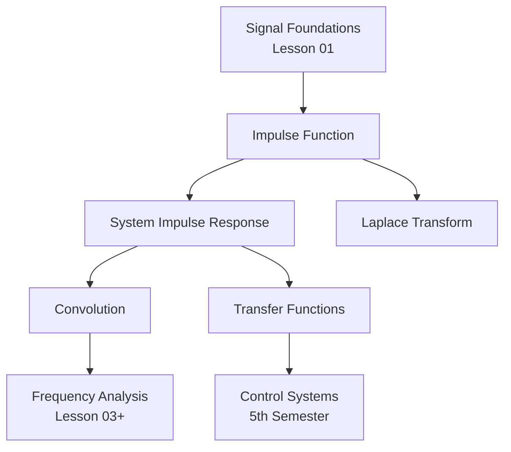

# Lesson 02 Synthesis: Impulse Function and System Properties

> **What you've mastered**: You now understand one of the most powerful tools in signal processing—the impulse function—and how to classify and interconnect systems.

---

## Core Takeaways

### 1. The Impulse Function is a "Controlled Infinity"
- **Dirac delta δ(t)**: Zero everywhere except t=0, but with area =  1
- Not a classical function, but a **distribution** that behaves nicely under integration
- **Sifting property**: ∫ f(t) δ(t-t₀) dt = f(t₀)
- Relationship with unit step: δ(t) = du/dt

### 2. System Classification Matters
- **Continuous-time systems**: Modeled by differential equations (e.g., circuits)
- **Discrete-time systems**: Modeled by difference equations (e.g., financial models)
- The impulse response **h(t)** completely characterizes LTI systems

### 3. System Interconnections Build Complexity
- **Series/Cascade**: Output of one is input to next
- **Parallel**: Common input, outputs summed
- **Feedback**: Output fed back to input—foundation of control theory

---

## Conceptual Connections

---

## Where This Goes Next

**Immediate**:
- Lesson 03: Convolution and system analysis
- Lesson 04: Fourier series and transforms

**Downstream courses**:
- **Automatic Control**: Feedback systems, transfer functions
- **DSP**: Discrete impulse response, FIR/IIR filters  
- **Communications**: Channel modeling, equalization
- **Power Systems**: Fault transients, protection

---

## Self-Assessment Checklist

Can you:
- [ ] Explain why δ(t) is a "controlled infinity"?
- [ ] Derive the relationship between δ(t) and u(t)?
- [ ] Apply the sifting property correctly?
- [ ] Find the impulse response of a simple RC circuit?
- [ ] Distinguish continuous vs discrete systems?
- [ ] Draw block diagrams of series, parallel, and feedback systems?

If yes to all → You're ready to proceed!  
If no → Review the specific concept layer (intuition/engineering/mathematics).

---

## Key Formulas to Memorize

| Property | Formula |
|----------|---------|
| Sifting | ∫ f(t) δ(t-t₀) dt = f(t₀) |
| Step relation | δ(t) = du/dt |
| Scaling | δ(at) = δ(t) / \|a\| |
| Fourier transform | F{δ(t)} = 1 |
| Convolution identity | f(t) * δ(t) = f(t) |
| RC impulse response | h(t) = (1/RC) e^{-t/RC} u(t) |

---

**Total time invested**: ~3-4 hours  
**Concepts mastered**: 3  
**Problems solved**: 15+

You're now 2/15 (~13%) through the Signals & Systems module. Keep going!
